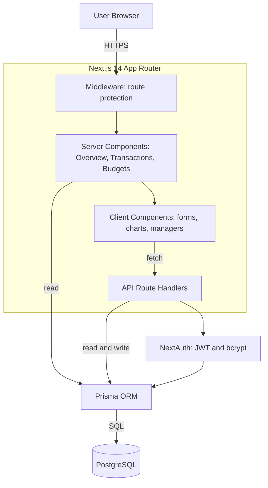

# Ledgerleaf — Personal Finance Platform

A full-stack personal finance application for tracking income and expenses, setting
monthly budgets by category, and visualizing where your money goes. Built with the
Next.js App Router, TypeScript, Prisma, and PostgreSQL, with email and password
authentication and strict per-user data isolation.

> Track your money, set budgets, and see your spending take shape, all in one calm, private dashboard.

---

## Features

- **Email and password auth** with bcrypt-hashed passwords and JWT sessions (NextAuth)
- **Transactions** — log income and expenses, categorize them, and remove them
- **Budgets** — set a monthly limit per category and track spending against it with live progress bars
- **Dashboard** — net balance, income and expense totals, a spending-by-category donut chart, and recent activity
- **Per-user isolation** — every query is scoped to the signed-in user, so accounts never see each other's data
- **Server-side validation** with Zod on every write endpoint, plus ownership checks before any read or mutation

---

## Tech stack

| Layer       | Technology                      |
| ----------- | ------------------------------- |
| Framework   | Next.js 14 (App Router)         |
| Language    | TypeScript                      |
| Database    | PostgreSQL                      |
| ORM         | Prisma                          |
| Auth        | NextAuth (Credentials provider) |
| Styling     | Tailwind CSS                    |
| Charts      | Recharts                        |
| Validation  | Zod                             |

---

## Architecture

The app uses the Next.js App Router, so most pages are React Server Components that read
from the database directly through Prisma, while interactive pieces (forms, charts) are
Client Components that call typed API route handlers. Middleware guards every dashboard
route, and NextAuth issues a JWT session that every request is checked against.



**Request lifecycle (adding a transaction):**

1. The user submits the form in a Client Component.
2. A `POST /api/transactions` request hits the route handler.
3. The handler reads the NextAuth session, rejects the request if there is none, and validates the body with Zod.
4. It confirms the chosen category belongs to the current user, then writes the row through Prisma.
5. The UI updates optimistically and the dashboard recomputes totals on the next read.

---

## Data model

```
User ──< Category ──< Transaction
  │          │
  │          └──< Budget
  └──< Transaction
  └──< Budget
```

- A **User** owns many categories, transactions, and budgets.
- A **Transaction** optionally belongs to a category and records an amount, type (income or expense), date, and note.
- A **Budget** sets a per-category monthly limit, with a unique constraint on `(userId, categoryId, month, year)` so each category has at most one budget per month.

---

## Project structure

```
src/
  app/
    api/            Route handlers: auth, register, transactions, budgets
    dashboard/      Protected app (overview, transactions, budgets)
    login/          Login page
    register/       Registration page
    page.tsx        Public landing page
  components/        Sidebar, charts, transaction and budget managers
  lib/               Prisma client, auth config, utils and Zod schemas
  types/             NextAuth type augmentation
  middleware.ts      Protects /dashboard routes
prisma/
  schema.prisma      Data models
  seed.ts            Demo data seed
```

---


## Security notes

- Passwords are never stored in plain text; only bcrypt hashes are persisted.
- Every write endpoint validates input with Zod and confirms resource ownership before reading or mutating data.
- Deletes are scoped by `userId`, so a user can only ever remove their own records.

---

## License

MIT
